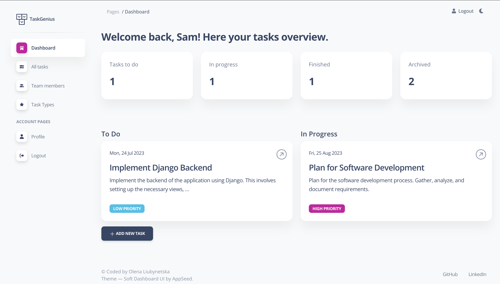

# Task Manager

> Django project to keep track of the tasks, prioritize work, set deadlines, 
> assign a worker responsible for a task, and
> achieve company goals.
 

## Check it out

[Task Manager project deployed to Render](PASTE LINK)

### User credentials for tests:

```
login: test_user
password: Test_12345
```

Feel free to create new tasks, assign them to teammates and write funny comments.


## Installing / Getting started

Python3 must be already installed.

```shell
git clone https://github.com/olenaliuby/task-manager.git
cd task-manager/
python3 -m venv venv
source venv/bin/activate
pip install -r requirements.txt
python manage.py runserver
```


## Features

* Authentication functionality for Worker/User;
* Dashboard of tasks assigned to the logged-in worker, organized by status;
* Paginated list of tasks, their statuses, priorities & deadlines with the ability to search by task name; 
* Detailed information about a specific task, including task type, assignees, and comments;
* Detailed information about a worker and their assigned tasks;
* Admin panel for advanced managing.


## Demo

